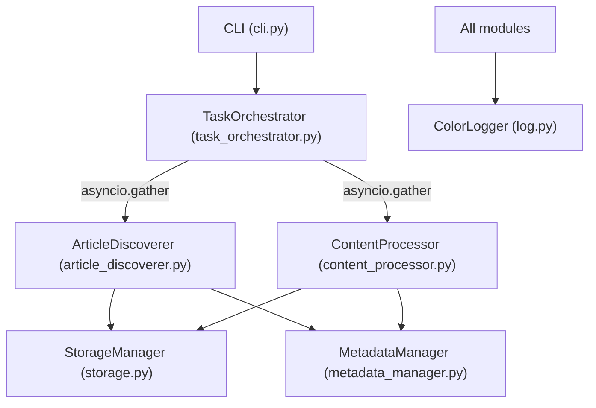
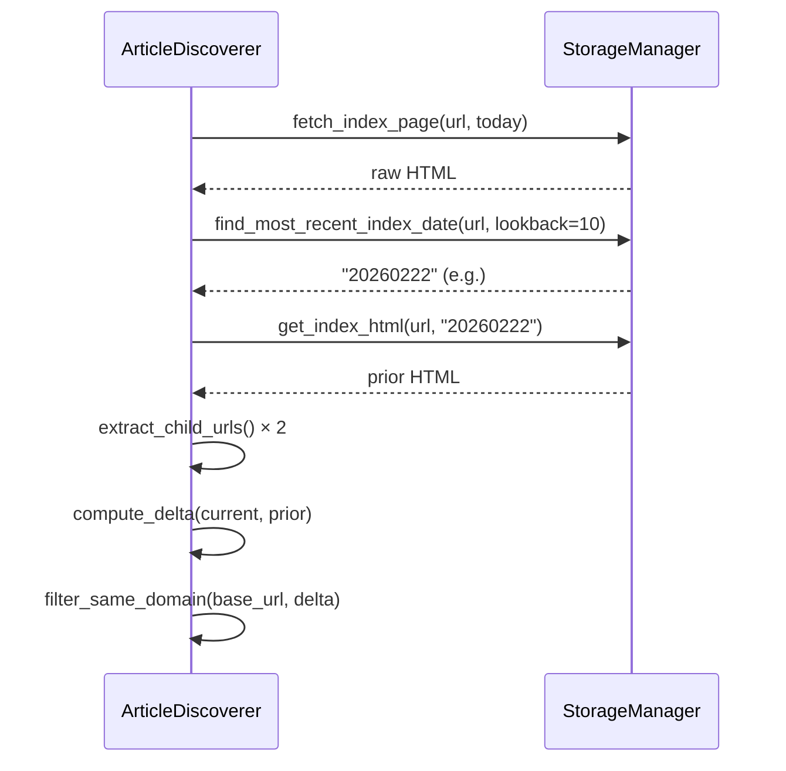
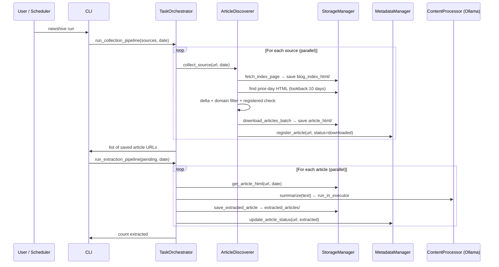

# Design Document — Newshive

> Architecture reference for developers. Explains *why* the system is built the way it is, not just *what* it does.

---

## Problem Statement

Most AI news aggregators rely on RSS feeds or third-party APIs. This project takes a different approach: it **monitors the blog index pages directly**, computes a delta of new article URLs against a prior-day snapshot, and uses a local LLM to extract and summarize content — with no external services required beyond Ollama.

---

## Architecture Overview



### Module Responsibilities

| Module                       | Single Responsibility                          |
| ---------------------------- | ---------------------------------------------- |
| `log.py`                     | ANSI-colored structured logging; nothing else  |
| `storage.py`                 | All file I/O; no business logic                |
| `metadata_manager.py`        | SQLite read/write; no business logic           |
| `article_discoverer.py`      | HTTP + HTML parsing + delta + domain filter    |
| `task_orchestrator.py`       | Orchestration only; delegates to other modules |
| `content_processor.py`       | Extracts article text, date, title, GitHub links; LLM call for summary; prepends metadata to summary |
| `cli.py`                     | User interface only; no business logic         |

---

## Key Design Decisions

### 1. Blog Index as Source of Truth

Rather than crawling links recursively (the old approach), the system treats each **blog index page** (e.g. `https://huggingface.co/blog`) as the authoritative list of posts. This is more predictable, faster, and avoids crawling unrelated pages.

**Trade-off:** The index page must list all recent posts in its HTML (not behind JavaScript rendering). Sites that paginate or use JS-only rendering may not work.

### 2. Delta via Filesystem Snapshots

New articles are discovered by:
1. Saving today's index HTML → `blog_index_html/YYYYMMDD/<url>.html`
2. Loading yesterday's saved HTML (walking back up to 10 days if needed)
3. Extracting links from both and computing the set difference

This approach requires **no database diff, no external state**, and works even if the pipeline misses days. The lookback window ensures resilience against pipeline failures.



### 3. Same-Domain + Sub-Path Filtering

From the delta, only URLs matching **both** the domain AND the base path prefix are kept:

```
base_url = "https://example.com/blog"

https://example.com/blog/post-1      ✅  same domain, sub-path of /blog
https://example.com/blog/tag/python  ✅
https://example.com/about            ❌  different path (/about)
https://other.com/blog/post          ❌  different domain
https://example.com/blog             ❌  the index itself
```

This prevents downloading category pages, tag archives, or unrelated site sections.

### 4. Parallelism via `asyncio.gather` + Semaphore

All I/O-bound work (HTTP fetches) is parallelized without external dependencies:

```python
# Bounded concurrency via semaphore
sem = asyncio.Semaphore(concurrency)

async def _bounded(url):
    async with sem:
        return await download_article(url)

results = await asyncio.gather(*[_bounded(u) for u in urls])
```

Two semaphores are used independently:
- `source_concurrency` (default 4) — parallel index page fetches
- `article_concurrency` (default 5) — parallel article downloads

Ollama calls (synchronous/blocking) are run via `loop.run_in_executor()` to avoid blocking the event loop.

### 5. Database Schema (no FK)

```sql
CREATE TABLE blog_sources (
    url       TEXT PRIMARY KEY,
    label     TEXT,
    added_at  TEXT
);

CREATE TABLE blog_articles (
    url          TEXT PRIMARY KEY,
    source_url   TEXT,         -- which index page this came from
    status       TEXT,         -- downloaded | extracted | error_fetch | error_llm
    scraped_at   TEXT,
    extracted_at TEXT,
    published_date TEXT,       -- NEW: Article's published date (ISO format)
    github_links TEXT          -- NEW: JSON array of GitHub repository links
);
```

The old schema had `articles → urls` with a FK constraint, which required pre-registering every URL before processing it. Articles are now discovered dynamically, so no FK is needed. `source_url` is a soft reference for traceability.

**Statuses:**

| Status        | Meaning                            |
| ------------- | ---------------------------------- |
| `downloaded`  | HTML saved, pending AI extraction  |
| `extracted`   | AI summary generated and saved     |
| `error_fetch` | HTTP/network error during download |
| `error_llm`   | AI extraction failed               |
| `skipped`     | Manually skipped                   |

### 6. Prior-Day Seed on `source add`

When `source add <url>` is called for the first time, the system writes an **empty HTML file** to `blog_index_html/<yesterday>/`. This ensures the first real `collect` run always has a prior-day baseline, preventing all historical articles from being treated as "new" on day one.

```
data/blog_index_html/
├── 20260223/
│   └── huggingface-co-blog.html   ← empty seed (created by source add)
└── 20260224/
    └── huggingface-co-blog.html   ← real index snapshot (created by collect)
```

### 7. Colored Logging

Each module has a dedicated ANSI color for its log prefix. This makes multi-module output easy to trace in `--debug` mode without a log aggregator. RED is strictly reserved for warnings and errors.

| Module               | Color   | Why                                 |
| -------------------- | ------- | ----------------------------------- |
| `article_discoverer` | Cyan    | Dominant output during collection   |
| `storage`            | Blue    | Secondary, file I/O confirmations   |
| `metadata_manager`   | Magenta | Distinct from storage; often paired |
| `task_orchestrator`  | Green   | Progress/success visibility         |
| `content_processor`  | Yellow  | Warm; long-running AI work          |
| Errors               | Red     | Immediate visual attention          |

Color output is disabled by setting `NO_COLOR=1` or passing `--no-color` to any command.

---

## Data Flow: End-to-End

The end-to-end pipeline now includes enhanced article processing:
- During article download, the raw HTML is saved.
- During AI extraction, `ContentProcessor` extracts title, published date, and GitHub links from the raw HTML.
- The AI-generated summary is then prepended with a Markdown metadata header containing the extracted title, date, and original URL.
- The extracted `published_date` and `github_links` are also stored in the database.



---

## Extension Points

### Add a new content domain
No code changes needed — just `source add <url>`. The domain filtering is automatic.

### Use a different LLM
Pass `--model <ollama-model-name>` at runtime. The `ContentProcessor` class is model-agnostic.

### Change the extraction prompt
Edit `ContentProcessor.summarize()` or modify the `system_prompt` within that method in `content_processor.py`. The `process_article` method orchestrates the full extraction.

### Add a new output format
Add a new method to `StorageManager` (e.g. `save_json_article`) and call it from `task_orchestrator.py`. No other changes required.

### Schedule daily runs
```bash
# crontab -e
0 7 * * * cd /path/to/newshive && uv run newshive run --no-color >> logs/daily.log 2>&1
```

---

## Testing Philosophy

- **Unit tests only** for core logic (no network in tests)
- `StorageManager` is tested against a real `tmp_path` filesystem
- `MetadataManager` is tested against a real in-memory SQLite file in `tmp_path`
- `ArticleDiscoverer` uses `MagicMock` for `StorageManager` and `respx` for HTTP
- No test should depend on external services (Ollama, internet)

```
tests/
├── test_article_discoverer.py    ← link extraction, delta, domain filter, fallback
├── test_storage.py               ← all folder types, seed, lookback
├── test_metadata_manager.py      ← CRUD for both tables, statuses
├── test_scraper.py               ← legacy (kept for compatibility)
├── test_cli.py                   ← Click command smoke tests
└── test_content_processor.py     ← mocked Ollama
```

---

## Known Limitations

| Limitation                       | Workaround                                                                    |
| -------------------------------- | ----------------------------------------------------------------------------- |
| JavaScript-rendered index pages  | Use a pre-fetched static HTML alternative URL                                 |
| Blogs without a list-style index | Not currently supported                                                       |
| Rate limiting by target sites    | Reduce `--article-concurrency`                                                |
| Very large article HTML          | Trafilatura's extraction may truncate; consider `--model` with larger context |
